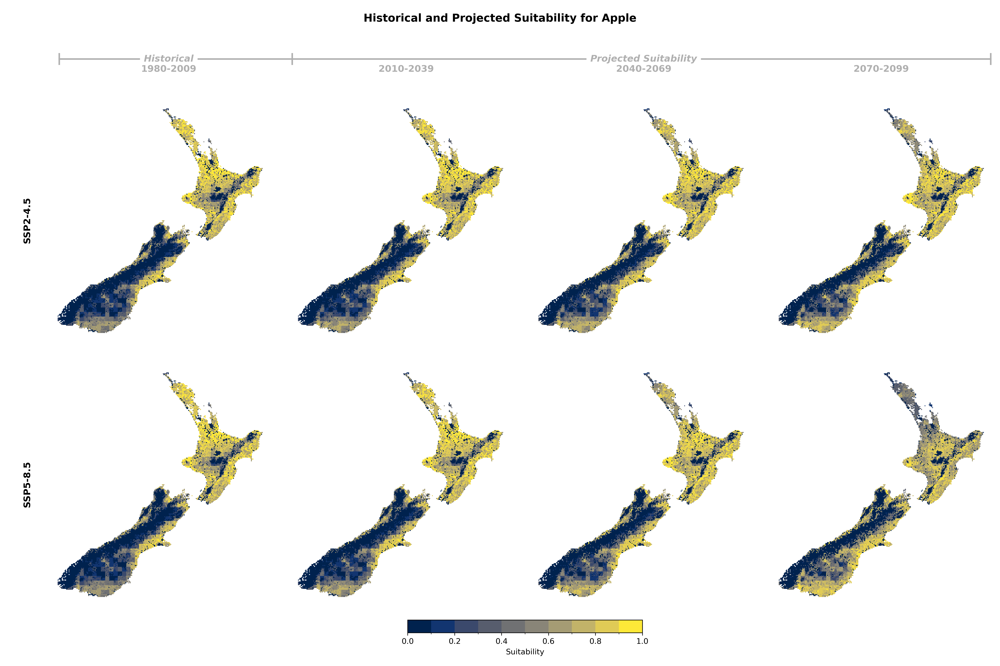
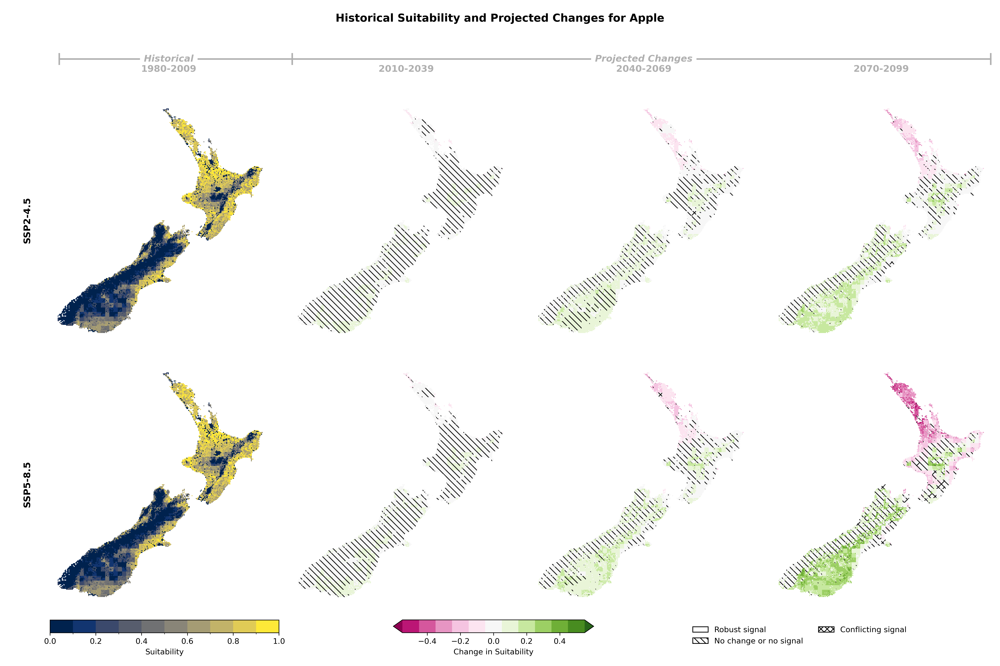

## Historical and Projected Suitability

::: {.panel-tabset}

### Suitability Values

### Suitability Changes

:::

## Suitability Criteria

The following criteria were used to model the suitability of Apple:

| Category | Criteria |
|:--------:|:---------|
| soil/Terrain | Potential Rooting Depth |
| soil/Terrain | Slope |
| soil/Terrain | Soil Drainage Class |
| soil/Terrain | Land Use Capability Class |
| Climate | Chill units between May 1 and Aug 31 |
| Climate | Growing degree days between Oct 1 and Apr 30 |
| Climate | Growing degree days between day of full bloom and 50 days after |
| Climate | Frost survival during growth period (from 3 weeks before full bloom to end of April) |
| Climate | Sunburn survival from Oct 1 to Apr 30 |
: {tbl-colwidths="[25,75]"}
