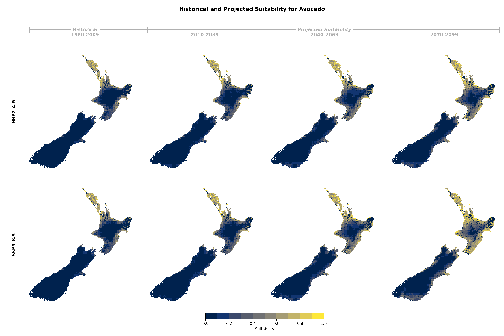
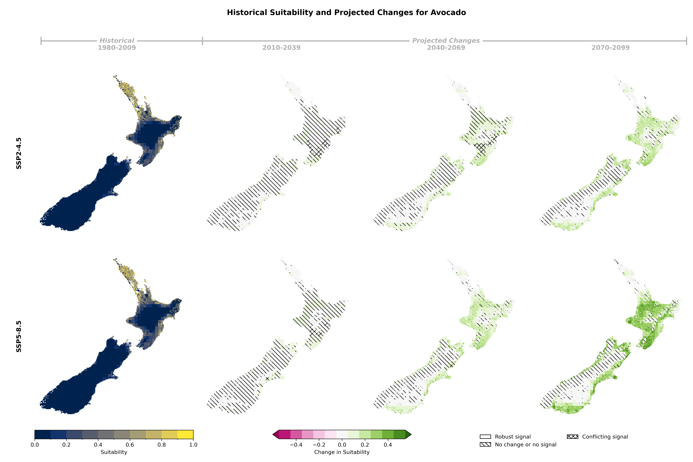

## Historical and Projected Suitability

::: {.panel-tabset}

### Suitability Values

### Suitability Changes

:::

## Suitability Criteria

The following criteria were used to model the suitability of Avocado:

| Category | Criteria |
|:--------:|:---------|
| soil/Terrain | Potential Rooting Depth |
| soil/Terrain | Slope |
| soil/Terrain | Soil Drainage Class |
| soil/Terrain | Land Use Capability Class |
| soil/Terrain | Soil pH |
| Climate | Annual frost survival |
| Climate | Mean annual temperature |
: {tbl-colwidths="[25,75]"}
