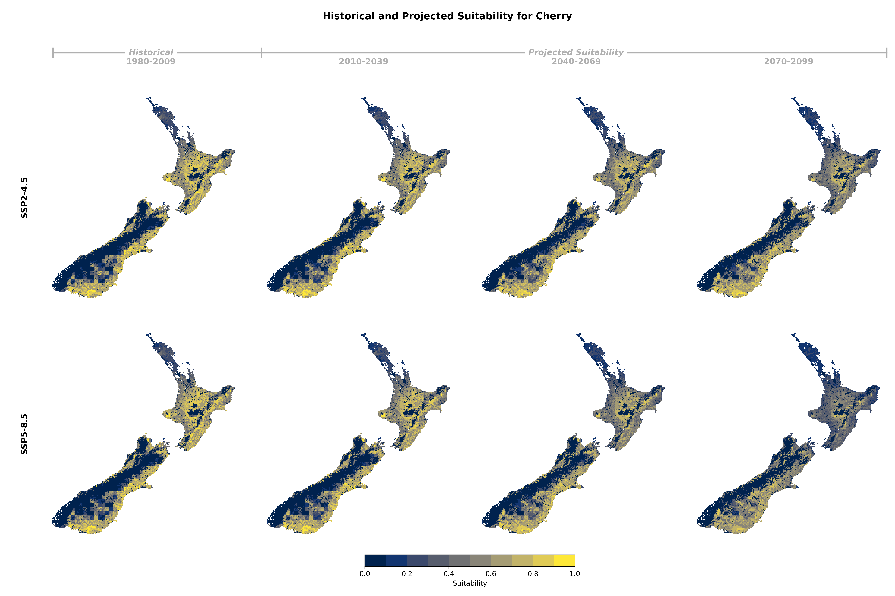
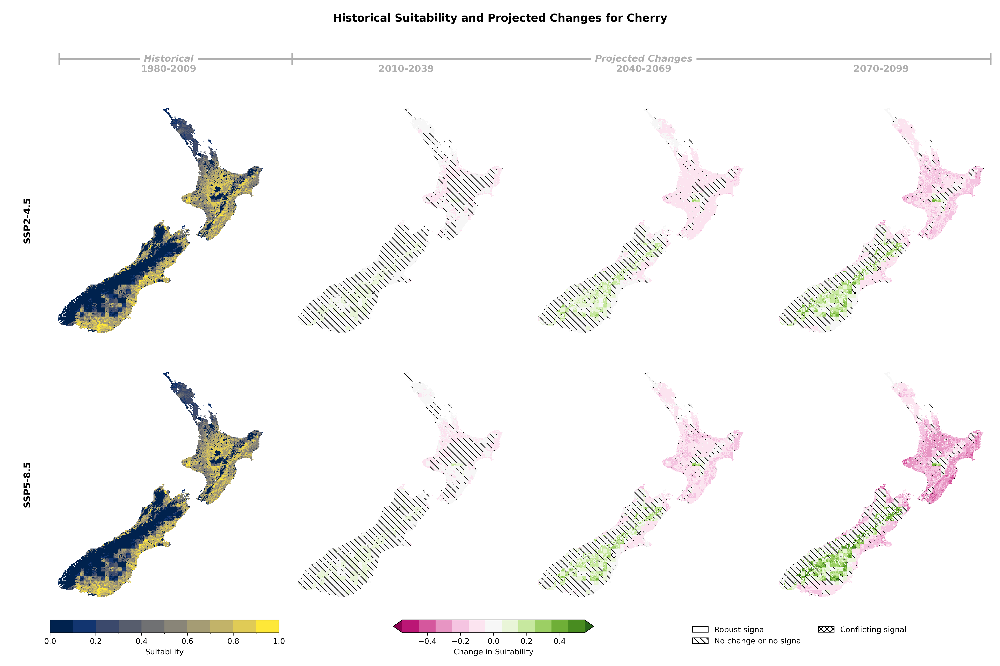

## Historical and Projected Suitability

::: {.panel-tabset}

### Suitability Values

### Suitability Changes

:::

## Suitability Criteria

The following criteria were used to model the suitability of Cherry:

| Category | Criteria |
|:--------:|:---------|
| soil/Terrain | Potential Rooting Depth |
| soil/Terrain | Slope |
| soil/Terrain | Soil Drainage Class |
| soil/Terrain | Land Use Capability Class |
| Climate | Chilling hours between Jun 1 and Aug 31 |
| Climate | Growing degree days between day of budbreak and Apr 30 |
| Climate | Frost and cold indicator as the product of frost survival and days from budbreak to 31 Dec |
| Climate | Craking survival from Nov 1 to ripening |
: {tbl-colwidths="[25,75]"}
