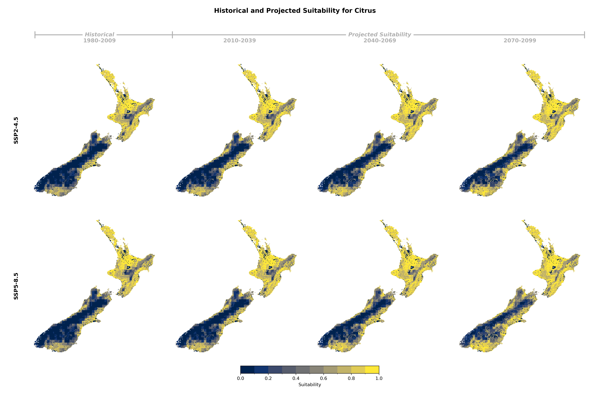
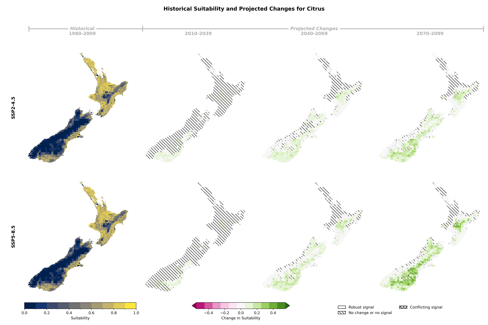

## Historical and Projected Suitability

::: {.panel-tabset}

### Suitability Values

### Suitability Changes

:::

## Suitability Criteria

The following criteria were used to model the suitability of Citrus:

| Category | Criteria |
|:--------:|:---------|
| soil/Terrain | Potential Rooting Depth |
| soil/Terrain | Slope |
| soil/Terrain | Topsoil Gravel Content |
| soil/Terrain | Salinity |
| soil/Terrain | Soil Potential Plant Available Water (mm) |
| soil/Terrain | Soil Drainage Class |
| soil/Terrain | Soil pH |
| Climate | Rainfall excess: annual total precipitation (mm) |
| Climate | Mean daily minimum temperature between Aug 15 and Oct 15 (°C) |
| Climate | Mean daily temperature between Sep 15 and Nov 15 (°C) |
| Climate | Mean daily maximum temperature between Jan 1 and Feb 15 (°C) |
| Climate | Number of years with at least one hot week (3 days over 35C in a 7-day period) between Dec 1 and Feb 28 (over 10 years) |
: {tbl-colwidths="[25,75]"}
