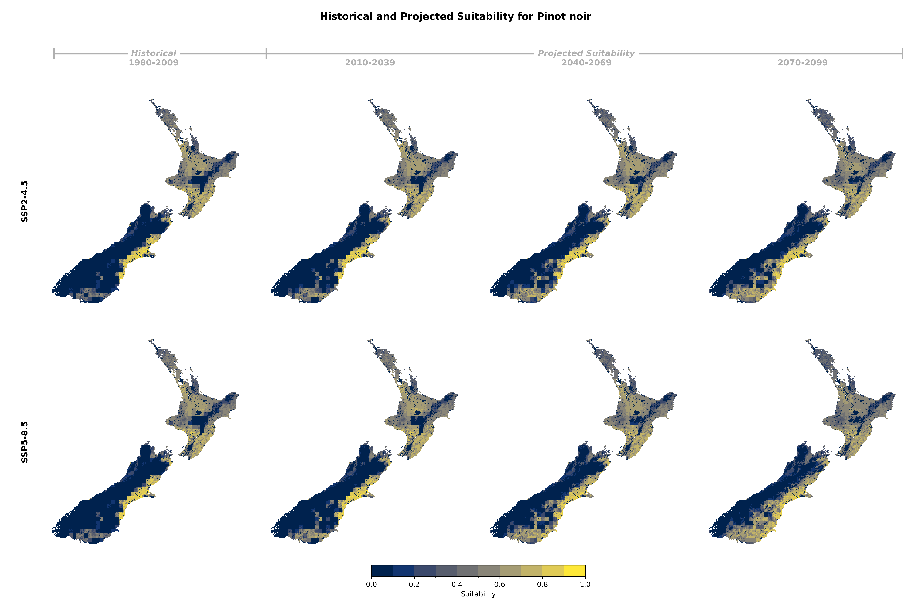
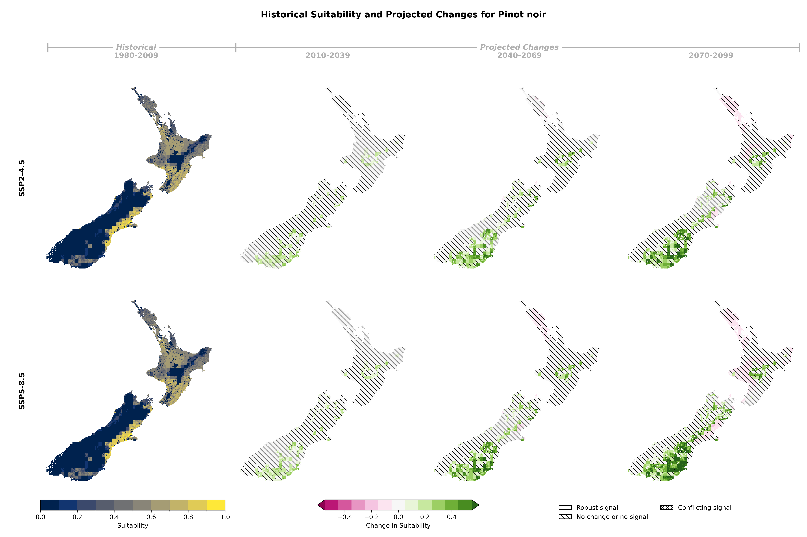

## Historical and Projected Suitability

### Pinot Noir

::: {.panel-tabset}

#### Suitability Values

#### Suitability Changes

:::

## Suitability Criteria

The following criteria were used to model the suitability of Pinotnoir:

| Category | Criteria |
|:--------:|:---------|
| soil/Terrain | Potential Rooting Depth |
| soil/Terrain | Slope |
| soil/Terrain | Soil Drainage Class |
| soil/Terrain | Land Use Capability Class |
| Climate | Chilling hours between Jun 1 and Aug 31 |
| Climate | Frost survival from budbreak to veraison |
| Climate | Heat survival from veraison to ripeness |
| Climate | Botrytis risk: total precipitation between Mar 1 and Apr 30 |
| Climate | Date of Ripeness |
: {tbl-colwidths="[25,75]"}
