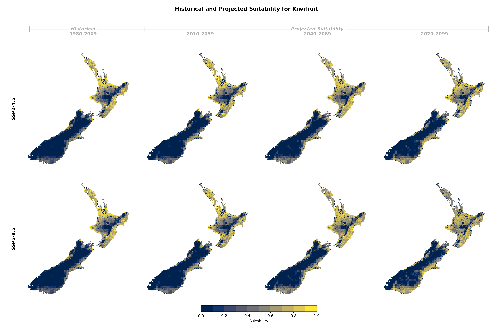
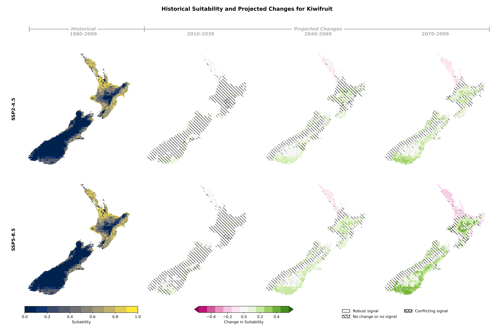

## Historical and Projected Suitability

::: {.panel-tabset}

### Suitability Values

### Suitability Changes

:::

## Suitability Criteria

The following criteria were used to model the suitability of Kiwifruit:

| Category | Criteria |
|:--------:|:---------|
| soil/Terrain | Potential Rooting Depth |
| soil/Terrain | Slope |
| soil/Terrain | Soil Drainage Class |
| soil/Terrain | Land Use Capability Class |
| Climate | Mean annual temperature between May 1 and Jul 31 |
| Climate | Growing degree days between Oct 1 and Apr 30 |
| Climate | Frost survival during growing period (Aug 13 to Jun 30) |
| Climate | Minimum annual temperature |
: {tbl-colwidths="[25,75]"}
