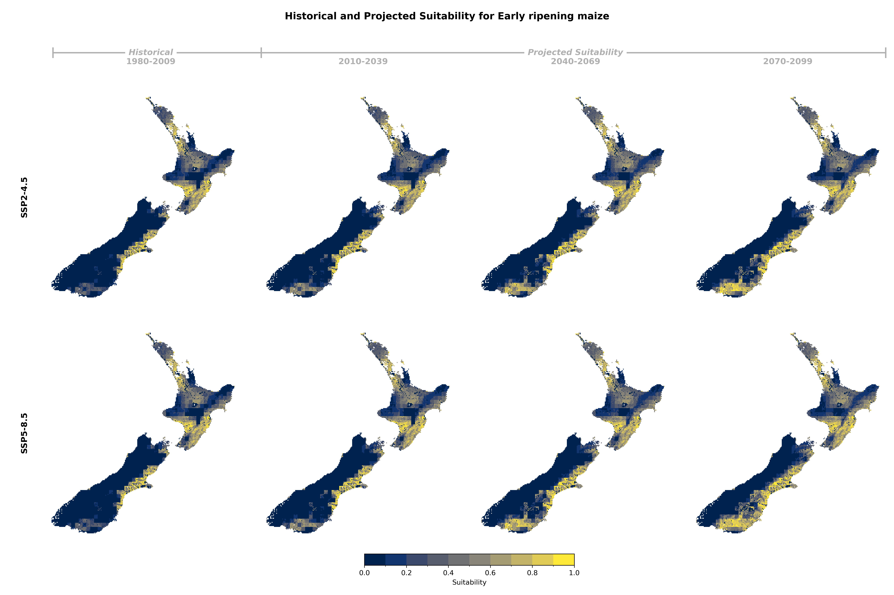
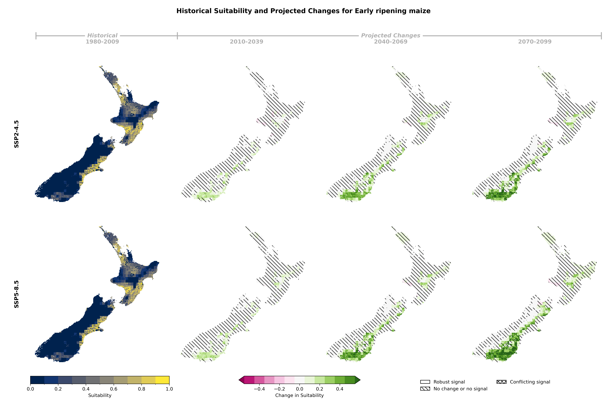
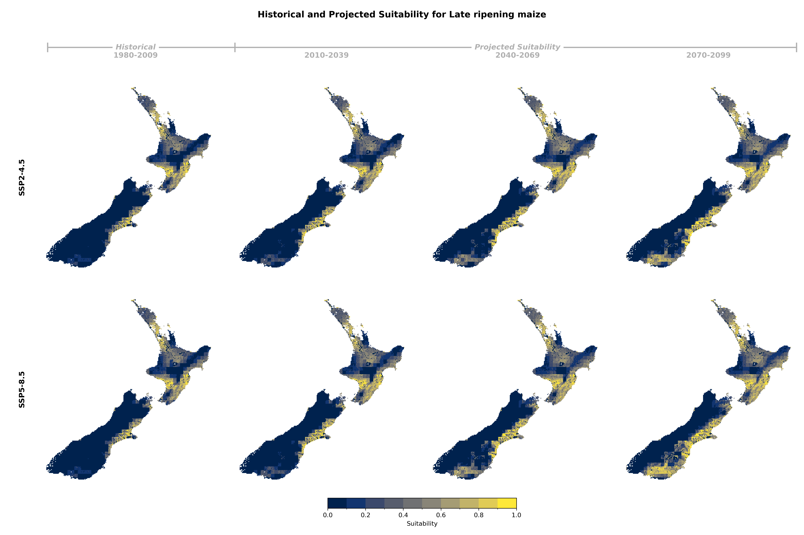

## Historical and Projected Suitability

### Early Ripening Maize

::: {.panel-tabset}

#### Suitability Values

#### Suitability Changes

:::

### Late Ripening Maize

::: {.panel-tabset}

#### Suitability Values

#### Suitability Changes

:::

## Suitability Criteria

The following criteria were used to model the suitability of maize:

| Category | Criteria |
|:--------:|:---------|
| soil/Terrain | Potential Rooting Depth |
| soil/Terrain | Slope |
| soil/Terrain | Topsoil Gravel Content |
| soil/Terrain | Salinity |
| soil/Terrain | Soil Drainage Class |
| soil/Terrain | Soil Potential Plant Available Water (mm) |
| Climate | Annual Rainfall Excess: total annual precipitation |
| Climate | Number of days below -6°C between emergence and beginning of stem elongation |
| Climate | Frequency of days above 35°C between anthesis +/- 30 days |
| Climate | Frequency of days with mean daily temperature below 10°C between flowering and maturity |
| Climate | Date of Maturity |
: {tbl-colwidths="[25,75]"}
