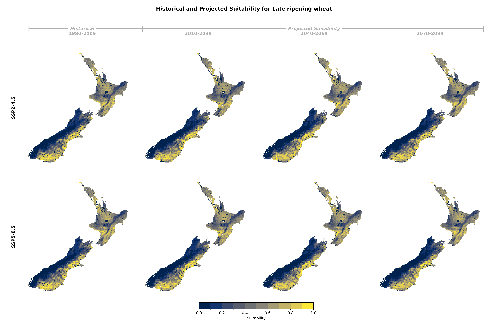
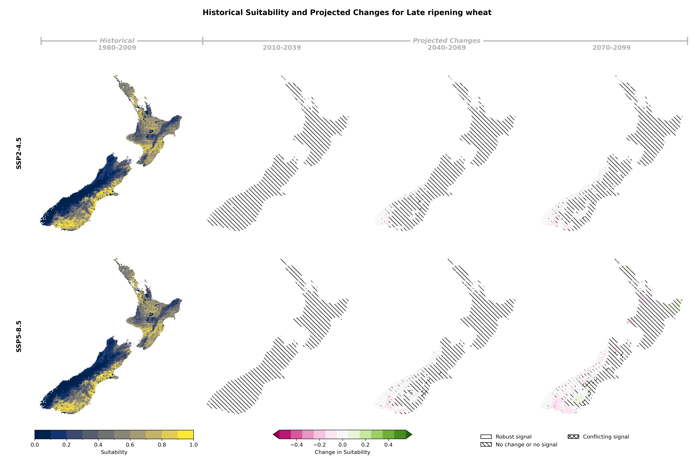

## Historical and Projected Suitability

::: {.panel-tabset}

### Suitability Values

### Suitability Changes

:::

## Suitability Criteria

The following criteria were used to model the suitability of Late ripening wheat:

| Category | Criteria |
|:--------:|:---------|
| soil/Terrain | Potential Rooting Depth |
| soil/Terrain | Slope |
| soil/Terrain | Soil Drainage Class |
| soil/Terrain | Soil Potential Plant Available Water (mm) |
| Climate | Annual Rainfall Excess: total annual precipitation |
| Climate | Number of years with at least 5 days below -8°C between crop emergence and ear 1cm |
| Climate | Number of years with at least 5 days below -2°C between ear 1cm and flag leaf |
| Climate | Number of years with at least 5 days above 30°C between anthesis +/- 30 days |
| Climate | Date of Maturity |
: {tbl-colwidths="[25,75]"}
